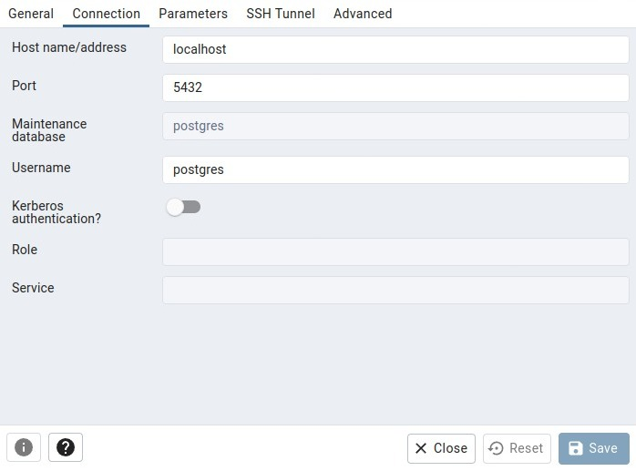

# MIC

## Definiciones:

Aqui van las definiciones **Funcionales** y **no Funcionales** del proyecto.

### Funcionales:

Definiciones de arquitectura, junto a documentacion para su mejor entendimiento.

#### Base de datos:

- PostgreSQL
- **Plugins**: PostGIS (datos espaciales)
- **ORM:** TypeORM
- **MinIO** (archivos)

#### Backend:

- NestJS (Arquitectura **[Hexagonal](https://codigoencasa.com/arquitectura-hexagonal/)**) (Typescript)

[[Documentacion extra](https://github.com/MarkelJaure/MIC/blob/dev/Gmail_-_Backend.PDF)]

#### Frontend:

- NextJS (Estructura **[Funcional](https://reboot.studio/blog/es/estructuras-organizar-proyecto-react)**) (Typescript)

[[Documentacion extra](https://github.com/MarkelJaure/MIC/blob/dev/Gmail_-_Front_end.PDF)]

### No Funcionales:

Definiciones de organizacion y estandares de programacion, junto a links utiles.

#### Programacion:

- **IDE:** VSCode
- **Lint:** ESLint
- **Gestor de base de datos:** PGAdmin4
- **Identador:** Prettier
- **Sistema operativo:** Linux
- **Cliente Rest/API:** Postman

#### Comunicacion:

- **[Discord](https://discord.gg/gbwrP3w3)**

- WhatApp

- **Google Meet** [Daily](https://meet.google.com/ijr-qxup-cxy)

#### Organizacion:

- **[Icescrum](https://cloud.icescrum.com/p/MICPM/#/project)**

#### Versionado:

- Git
- **[GitHub](https://github.com/MarkelJaure/MIC)**

**_Branchs:_**

- `Master`: rama principal, version lanzada en principio.
- `dev`: rama de desarrollo, version estable mas actual de la app.
- `branchs de features`: ramas inestables para desarrollar.

**_Workflow:_**

Pasos para desarrollar una nueva feature:

- Crear una rama con el siguiente Formato: `R<N⁰ de release>_<N⁰ Sprint>_<N⁰ Tarjeta>_<Descripcion>` (En caso de ser una tarea urgente: `R<N⁰ de release>_<N⁰ Sprint>_U_<Descripcion>`)., Ej: `R2_4_13_Login_Usuario`, `R2_4_U_Fix_Tabla_Lugares`
- Realizar el trabajo en la rama con los correspondientes add,commit,push
- Volver a dev, bajar cambios, mergear y subir la nueva funcionalidad (DEV siempre debe ser una version estable).

Ejemplo workflow:

```
- git branch (verificar estar en rama dev)
- git branch R2_4_U_Fix_Tabla_Lugares
- git checkout R2_4_U_Fix_Tabla_Lugares
- git add .
- git commit -m "corregido el bug visual de la tabla de lugares"
- git push origin R2_4_U_Fix_Tabla_Lugares
- git checkout dev
- git pull origin dev
- git merge R2_4_U_Fix_Tabla_Lugares
- git push origin dev
```

- Antes del `add` de los cambios, recordar ejecutar `npm run lint` en `backend` y `client` para formatear y encontrar errores en el codigo.
- Mandar al discord en la rama `branchs` al crear una rama, Ej: `<Nombre rama>`
- Mandar al discord en la rama `branchs` al mergear una rama con otra, Ej: `merge <Nombre rama> -> <Nombre rama>`, ademas indicar instrucciones si se requiriese, ej: migrate, test, seeders, etc.

## Instructivo instalacion y despliegue de desarrollo:

Instructivo para instalar y desplegar la aplciacion en modo desarrollo

### Instalacion

1. Verificar version de node: `node -v` (recomendamos la version 18.15.0, que se puede obtener desde [aqui](https://www.digitalocean.com/community/tutorials/como-instalar-node-js-en-ubuntu-18-04-es#instalacion-con-nvm) siguiendo la seccion `Instalación con NVM`)
1. Clonar el proyecto: `git clone git@github.com:MarkelJaure/MIC.git`
1. Ingresar a la carpeta del proyecto: `cd ./MIC`
1. Crear la rama dev localmente: `git branch dev`
1. Cambiarte a la rama dev: `git checkout dev`
1. Traerte los cambios remotos de la rama dev: `git pull origin dev`
1. Instalar [PostgreSQL](https://www.postgresql.org/download/linux/ubuntu/) y [PGAdmin4](https://www.commandprompt.com/education/how-to-install-pgadmin-on-ubuntu/).
1. Verificar version de PostgreSQL: `psql --version`
1. Instalar PostGIS: `sudo apt install postgresql-<version>-postgis-3` (Modificar `<version>` por la version de PSQL, solo los numeros enteros)
1. Desde la terminal crear el usuario default: `sudo -u postgres psql` -> `ALTER USER postgres PASSWORD 'postgres';`
1. Desde PGAdmin4, registrar el servidor `localhost`:
   
1. Crear Base de datos `mic`
1. Desde la terminal agregar la extension PostGIS: `sudo -u postgres psql -d mic` -> `CREATE EXTENSION postgis;`
1. Instalar [MinIO](https://min.io/docs/minio/linux/index.html?ref=docs-redirect): `wget https://dl.min.io/server/minio/release/linux-amd64/archive/minio_20230804174021.0.0_amd64.deb -O minio.deb sudo dpkg -i minio.deb`
1. Crear carpeta: `mkdir ~/minio`
1. Ejecutar MinIO:
   `
minio server ~/minio --console-address :9090`
1. Abrir en el navegador `http://127.0.0.1:9000` e iniciar sesion con user `minioadmin` y pass `minioadmin`
1. Dirigirse a `Administrator` -> `Indentity` - > `Users` -> `Create User` con username y password a eleccion, y permiso `readwrite`
1. Seleccionar el usuario y en `Service Accounts` -> `Create Access Key`, reemplazando las keys por los `...` en el paso siguiente.
1. En el directorio `backend`, crear el archivo `.env.local` con el siguiente contenido: <br>`MINIO_ENDPOINT=localhost`<br>
   `MINIO_PORT=9000`<br>
   `MINIO_ACCESS_KEY=...`<br>
   `MINIO_SECRET_KEY=...`<br>

- Instalar las dependencias y ejecutar migraciones:
  1. `cd ./backend`
  1. `npm i`
  1. `npm run migrate:up`
  1. `cd ../client/`
  1. `npm i`

**_Extras:_**

- Extensiones de **VSCode** que se utilizan

  1. `HTML Preview`.
  1. `Prettier - Code formatter`. Configurar el formateo automatico al guardar con Prettier `File` -> `Preferences` -> `Settings` -> Buscar y activar: `Editor: Format On Save`.
  1. `ESLint`

- En el _Postman_ se recomienda importar y trabajar las request del backend para su testeo:
  1. Abrir _Postman_
  1. Dentro de un `workspace` importar las request existentes guardadas en: `./backend/postman/MIC.postman_collection.json`
  - **Recordatorio:** Si se agregan o modifican request en postman, informar y mantener actualizado `MIC.postman_collection.json`.
  - **Tip:** Postman permite hacer un grupo de hasta 3 personas para ver un worspace. Pos lo que se pueden agrupar y importar el json en un workspace compartido.

### Despliegue

- Desde el directorio raiz del proyecto `mic`, abrir 2 terminales:

Terminal 1:

1.  Moverse a la carpeta backend: `cd backend`
1.  Desplegar el backend en modo dev: `npm run dev`
1.  Chequear desde `localhost:8000`

Terminal 2:

1.  Moverse a la carpeta backend: `cd client`
1.  Desplegar el backend en modo dev: `npm run dev`
1.  Chequear desde `localhost:3000`

Terminal 3: _Opcional en caso de utilizar la base de datos de archivos_

1.  Levantar la base de datos Minio: `minio server ~/minio --console-address :9090`

## Instructivo instalacion y despliegue en produccion:

Instructivo para instalar y desplegar la aplicacion en modo produccion

<!-- COMPLETAR -->

## Guía de desarrollo Backend

1. Crear funcion en controller (equivalente a las rutas en Node) que recibe "input", devuelve "payload". Solo llama a "case" y responde a client. src/infrastructure/{modulo}/rest/controller
1. Crear interfaz de caso de uso. src/domain/{modulo}/port
1. Crear caso de uso: aquí es donde se resuelve el problema, llama a repository en caso de tener que realizar llamados a la base de datos y devuelve entidad de dominio. src/domain/{modulo}/case/
1. Crear nuevos metodos en la interfaz de "repository" en caso de ser necesario. src/domain/{modulo}/port
1. Implementar los nuevos metodos en la clase de "repository".
   src/infrastructure/{modulo}/typeorm/repository
1. Actualizar migration y modelos en caso de modificar la entidad:
   -domain/model: entidad en el modelo de dominio
   -typeorm/model: entidad como se guarda la tabla en la base de datos
1. Actualizar el "module" del modelo de dominio con el nuevo caso de uso. src/infrastructure/modules

### Tips:

1. Métodos con nombre representativo del caso de uso en funciones de controller y carpeta "domain". (Por ejemplo: Login)
1. Métodos con nombre representativo de la query en repository. (Por ejemplo: findByEmail)
1. Mantener actualizado el archivo de postman, cargar las nuevas rutas que creemos en los controllers.
1. Nuevos inputs en caso de ser necesario y modificar los payloads en caso de que cambie el modelo con datos importantes.
1. El caso de uso es el encargado de lanzar errores en caso de no poder cumplir con la funcion (Ej: mail invalido en login)

### Pasos para crear migrations

1. Instalar typeorm de manera local en caso de no tenerlo: 
   `sudo npm install -g typeorm`
1. Moverse al directorio backend y correr el comando: `typeorm migration:create ./src/infrastructure/migrations/{nombre de la tabla a crear}`
   - Reemplazar {nombre de la tabla a crear} con el valor correspondiente.
   - *Tip*: Para correr el comando anterior: si el nombre de la tabla es más de una palabra se recomienda utilizar       el formato con Camel Case, por ejemplo UserRoles, pero para el nombre de las tablas utilizamos el formato con _.     En este caso la tabla se llama user_roles.
1. Se creará un archivo nuevo con dos métodos vacíos, completar el contenido de el 'up' para que cree la tabla, se le deberá indicar el nombre de la tabla y las columnas que tiene (puede verse el ejemplo de la migration de User). Además, si tiene alguna foregin key se deberá agregar la constrain luego de definir las columnas (puede verse el ejemplo de la migration de UserRoles).
1. Completar el contenido del método 'down' para que se encargue de eliminar la tabla.

### Pasos para agregar seeders

1. En el directorio backend/scr/infrastructure/seeders/seeds/json crear el archivo con datos a insertar.
1. En el directorio backend/scr/infrastructure/seeders/seeds/ crear el archivo .seeds.ts que recorre el json creado anteriormente y va realizando el insert en la tabla correspondiente (En caso de tener fk ver el ejemplo de user_roles).
1. En el archivo backend/scr/infrastructure/seeders/init.seeders.ts importar el seed creado en el paso anterior y agregarlo al arreglo de seeds.
